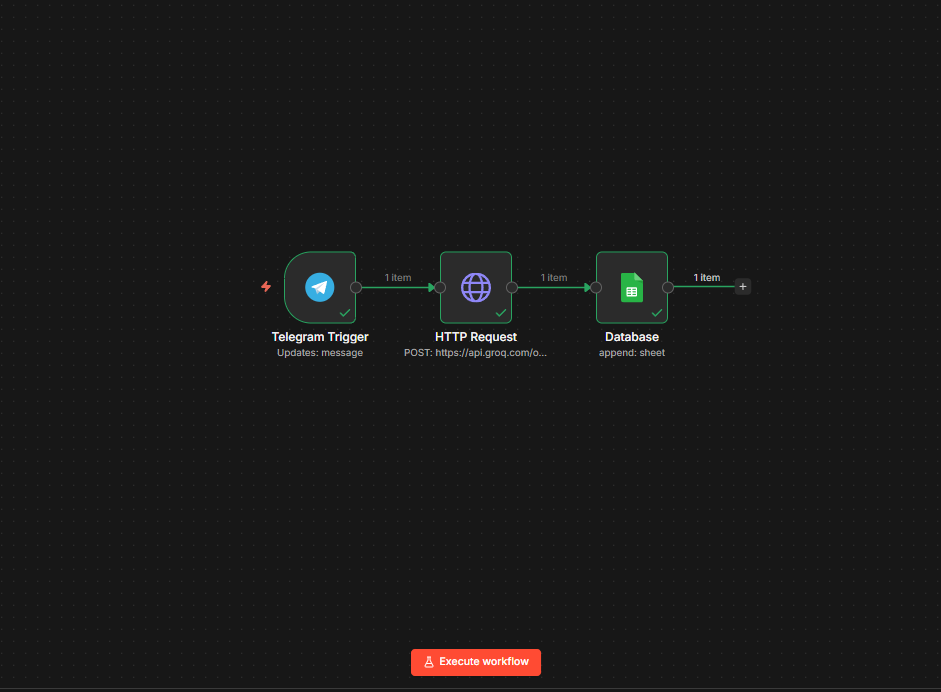
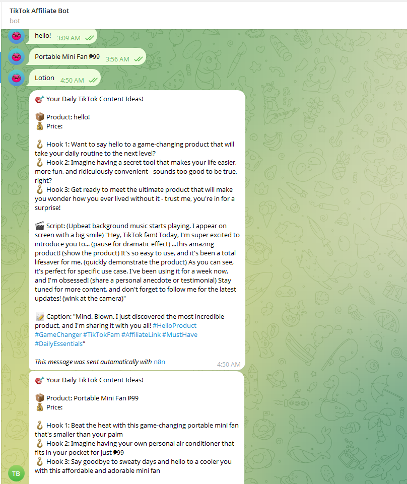

# TikTok Affiliate Content & Lead Automation Bot

AI-powered Telegram assistant that lets TikTok affiliates input products instantly and receive ready-to-post content—while automatically organizing everything in a content database.

---

## Overview

This system acts as a **real-time content assistant + input tool** for TikTok affiliates.

Instead of:
- Opening spreadsheets  
- Manually logging products  
- Thinking of what to post  

You simply send a message in Telegram.

The system handles everything automatically.

---

## The Problem

TikTok affiliates deal with:

- “Ano ba ang ipopost ko today?”
- Manually entering product data into sheets  
- Wasting time switching between tools  
- Inconsistent content workflow  

---

## The Solution

Built an n8n automation that:

- Accepts product input via Telegram  
- Instantly generates TikTok-ready content  
- Automatically logs everything into Google Sheets  
- Acts as a daily content assistant  

---

## Key Features

- **Telegram-Based Input (No Spreadsheet Needed)**  
  Just type:  
  `/new baby lotion 99 pesos`

- **Instant AI Content Generation**  
  Generates:
  - 3 viral hooks  
  - 1 short-form script (15–30 sec)  
  - 1 caption + hashtags  

- **Automatic Data Logging**  
  Product + content is saved directly to Google Sheets  

- **All-in-One Workflow**  
  Input → Content → Storage → Done  

- **Taglish Output (Localized Content)**  
  Optimized for Filipino TikTok audience  

---

## Example Output

```
🎯 Your Daily TikTok Content Ideas!

📦 Product: Portable Mini Fan ₱99  

🪝 Hook 1: Beat the heat with this game-changing portable mini fan  
🪝 Hook 2: Imagine having your own personal aircon for just ₱99  
🪝 Hook 3: Say goodbye to sweaty days  

🎬 Script:  
"Hey guys, I'm so excited to share this mini fan..."

📝 Caption:  
Stay cool for just ₱99! #TikTokBudol #SummerFinds
```

---

## Workflow Overview



---

## Telegram Interaction



---

## Data Storage (Google Sheets)


---

## Sample Outputs

📄 See more examples: `/samples/sample-output.md`

---

## Tech Stack

- n8n (workflow automation)  
- OpenAI API (content generation)  
- Telegram Bot API (input/output)  
- Google Sheets (data storage)  

---

## How It Works

1. User sends product via Telegram  
2. AI generates hooks, script, and caption  
3. Data is saved automatically to Google Sheets  
4. Content is ready to post instantly  

---

## System Architecture

This project uses a two-workflow system:

1. **Content Input Bot (Telegram)**
   - Accepts product input
   - Generates content using AI
   - Stores results in Google Sheets

2. **Daily Content Delivery (Digest System)**
   - Pulls “Draft” content from database
   - Sends daily TikTok ideas via Telegram

This creates a complete content workflow:
Input → Generate → Store → Deliver

## Impact

- Eliminates manual product entry into spreadsheets  
- Saves 1–2 hours daily on content ideation  
- Simplifies workflow into a single Telegram command  
- Provides ready-to-post TikTok content instantly  

---

## Proof

- Workflow screenshots in `/screenshots`  
- Sample outputs in `/samples`  
- n8n workflow JSON in `/workflow`  

---

## Use Case

- TikTok Shop affiliates  
- Content creators managing multiple products  
- Virtual assistants handling content workflows  

---

## Key Takeaway

This project demonstrates how AI + automation can turn a multi-step manual workflow into a simple chat-based system.

---

## Notes

Sensitive credentials (API keys, tokens, IDs) have been removed.  
Connect your own credentials when importing the workflow.

---

## Built By

Marla Daniella  
AI Automation & Workflow Systems Builder
